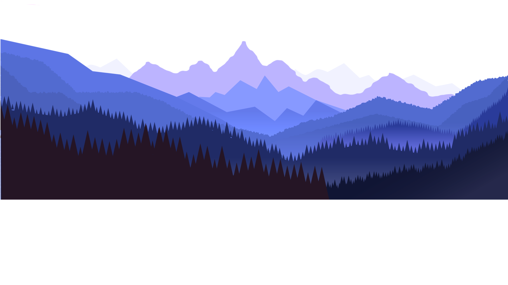
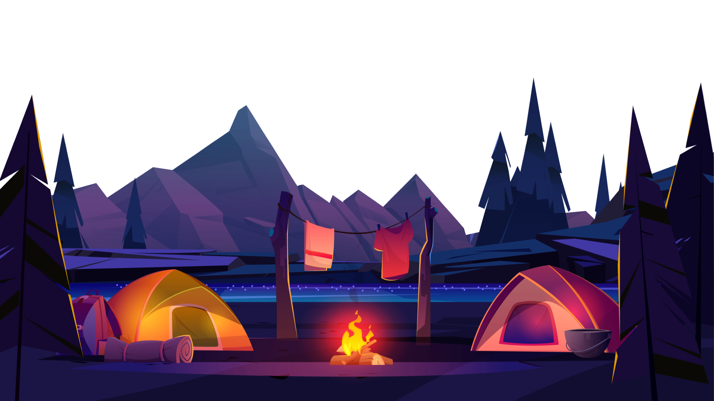

# Get-this-startpage-to-work
I wanna do my website to work

HTTP and CSS issue. I can't get the picture of the telescope to be on the top of the mountain picture.

How do place the pictures to be in the right order. I aslo follow the moon, but I want it to have its own speed in the scroll-function. The last thing is how do I get the pictures to stay the same size regardless of the resolution?

<!DOCTYPE html>
<html>
<head>
    <title>MoonTalk</title>
    <link rel="stylesheet" href="./2.css">
</head>
  <body>
    <header>
      <a href="#" class="logo">MoonTalk</a>
      <ul>
        <li><a href="#" class="active">Logga in</a></li>
        <li><a href="#">Bli Medlem</a></li>
        <li><a href="#">Om Oss</a></li>
        <li><a href="#">Sekretess</a></li>
      </ul>
    </header>
    <section>
        
        
        
        
        
        <h2 id="text">MoonTalk</h2>
        <a href="#sec" id="bnt">Utforska</a>
        
    </section>
    

        <h2>HAFGC</h2>
        

                                                                                                                                                                  
        

    

    

    

    

</body>
</html>

CSS -------------------______------_--_--------------------------------------------------

@import url('https://fonts.googleapis.com/css?family=Poppins:300,400,500,600,700,800,900&display=swap');
*
{
  margin: 0;
  padding: 0;
  box-sizing: border-box;
  font-family: 'Poppins', sans-serif;
  scroll-behavior: smooth;
}
body
{
  min-height: 100vh;
  overflow-x: hidden;
  background: linear-gradient(#4b6dd6,#050b1c)
}
header
{
  position: absolute;
  top: 0;
  left: 0;
  width: 100%;
  padding: 30px 100px;
  display: flex;
  justify-content: space-between;
  align-items: center;
  z-index: 10000;
}
header .logo
{
  color: #fff;
  font-weight: 700;
  text-decoration: none;
  font-size: 2em;
  text-transform: uppercase;
  letter-spacing: 2px;
}
header ul
{
  display: flex;
  justify-content: center;
  align-items: center;
}
header ul li
{
  list-style: none;
  margin-left: 20px;
}
header ul li a
{
  text-decoration: none;
  padding: 6px 15px;
  color: #fff;
  border-radius: 20px;
}
header ul li a:hover,
header ul li a.active
{
  background: #fff;
  color: #2b1055;
}
section
{
  position: fixed;
  width: 100%;
  height: 100vh;
  min-height: 100%;
  display: flex;
  justify-content: center;
  align-items: center;
  overflow: hidden;
}
    section img#stars {
        position: fixed;
        top: 0;
        left: 0;
        width: 100%;
        height: 100%;
        object-fit: cover;
        pointer-events: none;

    }
    section img#kikare {
    z-index: 500;
    position: fixed;
    top: 0;
    left: 0;
    width: 100%;
    height: 100%;
    object-fit: cover;
    pointer-events: none;
}
    section img#rocket {
        z-index: 0;
        position: fixed;
        top: 0;
        left: 0;
        width: 100%;
        height: 100%;
        object-fit: cover;
        pointer-events: none;
    }
    section img#moon {
        mix-blend-mode: screen;
        position: fixed;
        top: 0;
        left: 0;
        width: 100%;
        height: 100%;
        object-fit: cover;
        pointer-events: none;
    }

  
    section img#mountains_front {
        z-index: 10;
        position: fixed;
        top: 0;
        left: 0;
        width: 100%;
        height: 100%;
        object-fit: cover;
        pointer-events: none;
    }
    section img#mountains_behind {
        position: fixed;
        top: 0;
        left: 0;
        width: 100%;
        height: 100%;
        object-fit: cover;
        pointer-events: none;
    }

#text
{
  position: absolute;
  right: -650px;
  color: #fff;
  white-space: nowrap;
  font-size: 7.5em;
  z-index: 9;
  position: fixed;
}
#t {
    color: #fff;
    white-space: nowrap;
    font-size: 7.5em;
    z-index: 9;
    position: fixed;
}
#bnt
{
  top: 30%;
  text-decoration: none;
  display: inline-block;
  padding: 8px 30px;
  border-radius: 40px;
  background: #fff;
  color: #2b1055;
  font-size: 1.5em;
  z-index: 100;
  transform: translateY(150px);
  position: fixed;
}
.sec
{
  position: relative;
  padding: 100px;
  background: none;
}
.sec h2
{
  font-size: 3.5em;
  margin-bottom: 10px;
  color: #fff;
}
.sec p
{
  font-size: 1em;
  color: #fff 
}

